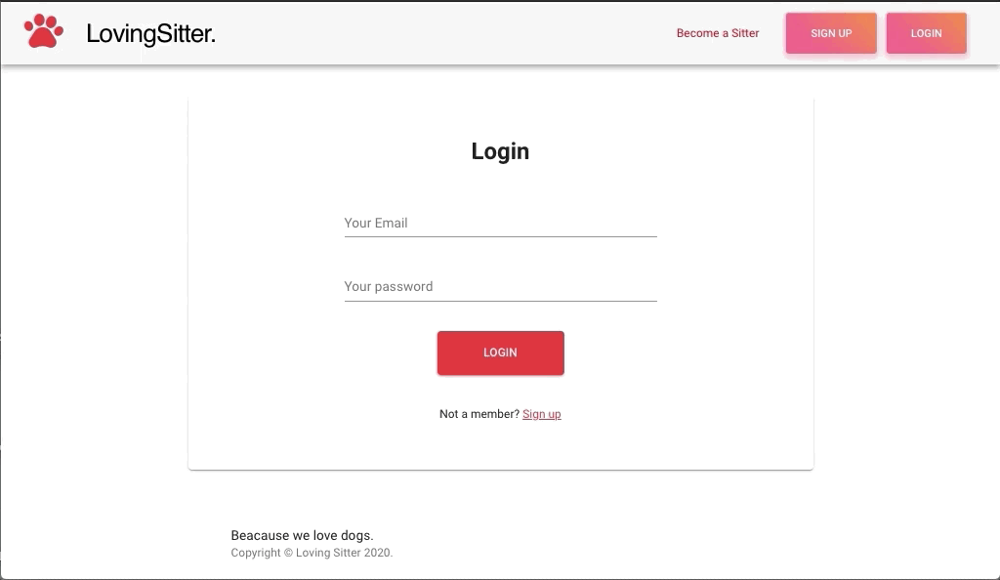
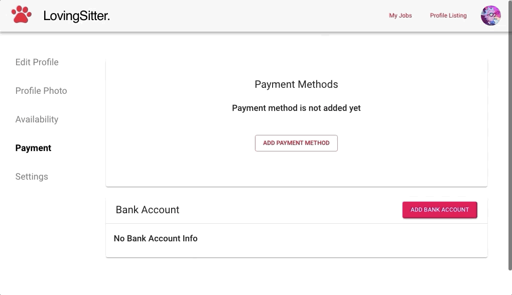

# Loving Sitter
This Web Application helps your furry family members with a massive community of pet lovers, offering pet sitting, dog walking, grooming & boarding services. Whatever you and your pet are into, we’re into it, too. And we’ve got your back. Anytime. Anywhere.

## Getting Started
### Prerequisites
* [Node.js](https://nodejs.org/en/)
* [npm](https://www.npmjs.com/)
### Installing
* Cloning this repo: run git clone https://github.com/hatchways/team-lasagna.git
* Installing dependencies: run ```npm install``` in ```\server``` AND ```\client``` directories

## Demo
* Login



* Upload Profile Picture


* Add Payment Method



* Make Request


## Technologies
#### Server-side
* [Node.js](https://nodejs.org/en/)
* [Express.js](https://expressjs.com/)
* [MongoDB](https://www.mongodb.com/)
* [Mongoose](https://mongoosejs.com/)
* [AWS S3](https://aws.amazon.com/s3/)
* [Stripe](https://stripe.com/)
#### Client-side
* [React.js](https://reactjs.org/)
* [Material-UI](https://material-ui.com/)
* [Stripe](https://stripe.com/)

## Authors
* [Din](https://github.com/langdin)
* [Ayo](https://github.com/hiroyalty)
* [Frank](https://github.com/xiezihen)

## Acknowledgements
* Guidance from [Bonnie](https://github.com/bonnieli)
